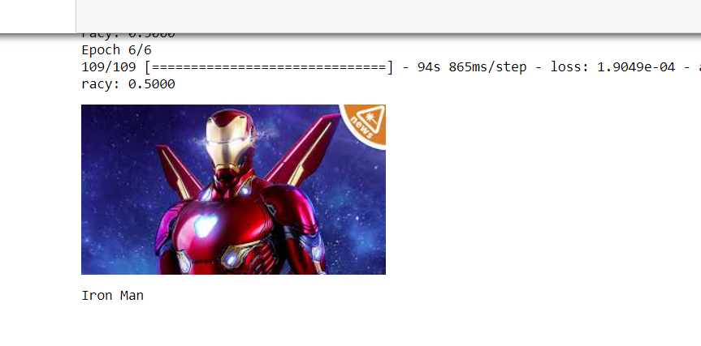
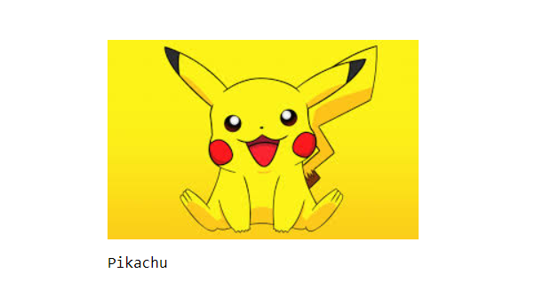

# Image-Classification-using-CNN withe KERAS & Tensorflow
A CNN model to classify an image dataset from kaggle.

This is a datset containing images of iron man and pikachu. We will train our convolutional neural network to classify between the two characters 
Extract the dataset.rar in the folder and then run either .py file or .ipynb file

